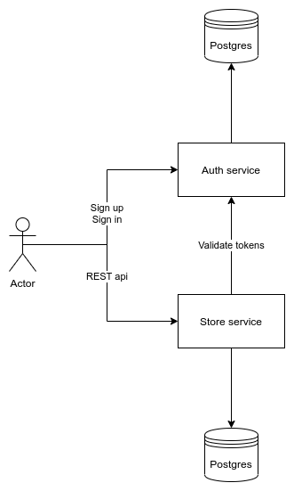

# Домашняя работа по курсу распределенных вычислений
Требуется написать бэкенд, где будет реализована логика
работы с товарами посредством REST API. Сервис должен уметь следующее:

1) Создавать товар
2) Удалять товар
3) Выводить список товаров (за пагинацию отдельный плюс)
4) Выводить отдельный товар
5) Редактировать товар

В сущности “товар”, должны быть предусмотрены следующие поля:
1) Название товара
2) Код товара
3) Категория (можно цифрой, можно прям словами)

Postman collection at ./store-service/items.postman_collection.json

## Run with docker
```(bash)
docker-compose up --build
```

## Architecture

